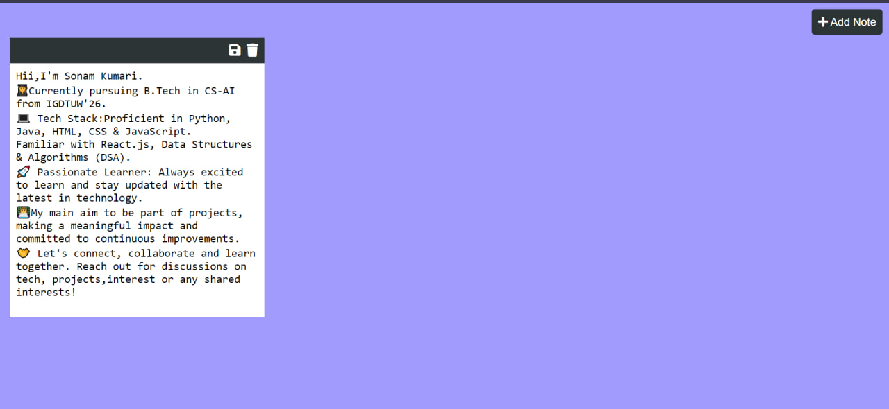

# My-Notes

Welcome to MyNotes, a simple and intuitive notes app built with HTML, CSS, and JavaScript! With MyNotes, you can effortlessly create and organize your notes, helping you stay productive and organized.
Using MyNotes is easy – simply create a new note, give it a title, and start jotting down your thoughts. You can also delete notes that you no longer need, keeping your workspace clutter-free.
Website hosted here: https://notes-app-443.netlify.app/

